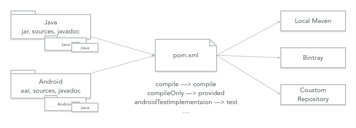

# Gradle Maven Publication

[](https://bintray.com/kaedea/moe-studio/publication/_latestVersion)
[](https://travis-ci.org/kaedea/gradle-maven-publication)



Gradle scripts/plugin that helps to publish jar/aar artifacts with gradle `maven` or `maven-publish` plugin.

This repository contains two components: scripts and plugin:
1. The scripts work just like [chrisbanes/gradle-mvn-push](https://github.com/chrisbanes/gradle-mvn-push) but support with both `maven` and `maven-publish`, as well as more customization with `pom.xml`. 
2. The plugin is going to be a custom gradle plugin which makes the workflow much simpler.

Of course, the scripts/plugin are designed to **work both with java and android project**.

## Project Structure

| Demo projects   | Description                   |
| :-------------- | :---------------------------- |
| app             | Demo app module               |
| lib-android     | Demo android library module   |
| lib-android-sub | Demo android library module 2 |
| lib-java        | Demo java library module      |
| lib-java-sub    | Demo java library module  2   |

| Script                        | Description                                                    |
| :---------------------------- | :------------------------------------------------------------- |
| gradle/maven.gradle           | Workaround script with gradle plugin 'maven'                   |
| gradle/maven-dcendents.gradle | Workaround script with 3rd-party gradle plugin 'android-maven' |
| gradle/maven-publish.gradle   | Workaround script with gradle plugin 'maven-publish'           |

| Plugin                    | Description                                                        |
| :------------------------ | :----------------------------------------------------------------- |
| gradle-plugin/publication | Custom gradle plugin that helps to publish jar/aar artifacts (WIP) |

## Getting Started

### Script

1. Config the properties required by the script.
2. Apply the script file on demand in 'build.gradle'.
3. Run the script tasks to publish artifacts to local/remote repository.

Config the project properties (gradle.properties) like:

```shell
GROUP=com.kaedea
VERSION_NAME=0.1.0-SNAPSHOT

RELEASE_REPOSITORY_URL=
SNAPSHOT_REPOSITORY_URL=
NEXUS_USERNAME=
NEXUS_PASSWORD=
```

Apply the script in your project's build.gradle:

```groovy
// We have 2 ways to apply the script:
// 1. apply from remote url
// 2. apply from scirpt file from 'project/gradle/..'

// For leagcy 'maven' plugin:
apply from: 'http://kaedea.github.com/gradle-maven-publication/gradle/maven.gradle'

// For dcendents's 'android-maven' plugin:
apply from: 'http://kaedea.github.com/gradle-maven-publication/gradle/maven-dcendents.gradle'

// For new 'maven-publish' plugin:
apply from: 'http://kaedea.github.com/gradle-maven-publication/gradle/maven-publish.gradle'
```

At last, run the following tasks to publish:

```bash
# For leagcy 'maven' or dcendents's 'android-maven' plugin:
gradle :uploadArchives

# For new 'maven-publish' plugin:
gradle :generatePomFileForArchivesPublication
gradle :publishToMavenLocal
gradle :publish
```

### Upload to Bintray

Apply the bintray script to upload the artifacts to Bintray/JCenter (additional).

Config the project properties like:

```shell
BINTRAY_USERNAME=
BINTRAY_API_KEY=
BINTRAY_REPO=maven
```

Apply the script in your project's build.gradle as [Script](#Script) above, then apply the bintray script:

```groovy
apply from: 'http://kaedea.github.com/gradle-maven-publication/gradle/bintray.gradle'
```

Run the following tasks to publish to Bintray:

```bash
gradle :bintrayUpload
```

### Plugin

Publication plugin works in the same way of `maven.gradle` but much simpler.

1. Apply the 'com.kaedea.publication' plugin.
2. Config the properties.
3. Run tasks to publish artifacts to local/remote repository.

Apply plugin like:

```groovy
buildscript {
    repositories {
        jcenter()
    }
    dependencies {
        classpath 'com.kaedea:publication:latest.integration'
    }
}
apply plugin: 'com.kaedea.publication'
```

Config the plugin:

```groovy
publication {
    GROUP('com.kaedea')
    VERSION_NAME('0.1.0-SNAPSHOT')

    RELEASE_REPOSITORY_URL('')
    SNAPSHOT_REPOSITORY_URL('')
    NEXUS_USERNAME('')
    NEXUS_PASSWORD('')

    uploadToBintray = true
    BINTRAY_REPO('maven')
    BINTRAY_USERNAME('kaedea')
    BINTRAY_API_KEY('bintray_api_key')
}
```

Now, here you go with the publish tasks

```bash
gradle :uploadArchives
gradle :bintrayUpload
```

## Advanced Configuration

There are much more extra configurations of both scripts and plugin.

### For Script

```shell
# 'optional': be configured or not
# 'required': must be configurated
# 'required here or system env': must be configurated in project properties or system environment

# ----------
# Maven repository config
# ----------
RELEASE_REPOSITORY_URL=  (required here or system env)
SNAPSHOT_REPOSITORY_URL= (required here or system env)

NEXUS_USERNAME= (required here or system env)
NEXUS_PASSWORD= (required here or system env)

POM_URL=https://github.com/kaedea/gradle-maven-publication/                   (optional)
POM_SCM_URL=https://github.com/kaedea/gradle-maven-publication/               (optional)
POM_SCM_CONNECTION=scm:git@github.com:kaedea/gradle-maven-publication.git     (optional)
POM_SCM_DEV_CONNECTION=scm:git@github.com:kaedea/gradle-maven-publication.git (optional)

POM_LICENCE_NAME=The Apache Software License, Version 2.0      (optional)
POM_LICENCE_URL=http://www.apache.org/licenses/LICENSE-2.0.txt (optional)
POM_LICENCE_DIST=repo                                          (optional)

POM_DEVELOPER_ID=kaedea           (optional)
POM_DEVELOPER_NAME=Kaede Akatsuki (optional)

# ----------
# Maven artifact config
# ----------
GROUP=com.kaedea            (required)
VERSION_NAME=0.1.0-SNAPSHOT (required)

POM_NAME=Publication                                   (optional)
POM_ARTIFACT_ID=publication                            (optional)
POM_PACKAGING=jar|aar                                  (optional)
POM_DESCRIPTION=Gradle plugin that make the publishing (optional)

# ----------
# Bintray auth config
# ----------
BINTRAY_USERNAME= (required here or system env)
BINTRAY_API_KEY=  (required here or system env)

# ----------
# Maven repo config
# ----------
BINTRAY_REPO=maven       (required)
BINTRAY_NAME=publication (optional)
```

### For Plugin

```groovy
// You can configure the publishing in the following, or gradle.properties, or System.env
// The configuration is almost the same with scripts above
// 'optional': be configured or not
// 'required': must be configured
// 'required input': be configured, or the console will ask you to input the value

publication {
    jarSources = true // optional
    jarJavaDoc = true // optional
    jarTests = true   // optional

    GROUP('com.kaedea')            // required
    VERSION_NAME('0.1.0-SNAPSHOT') // required

    POM_NAME('Publication')        // optional
    POM_ARTIFACT_ID('publication') // optional
    POM_PACKAGING('jar')           // optional
    POM_URL('https://github.com/kaedea/publication/')         // optional
    POM_DESCRIPTION('Gradle plugin that make the publishing') // optional

    POM_SCM_URL('https://github.com/kaedea/publication/')                         // optional
    POM_SCM_CONNECTION('scm:git:git://github.com/kaedea/publication.git')         // optional
    POM_SCM_DEV_CONNECTION('scm:git:ssh://git@github.com:kaedea/publication.git') // optional

    POM_LICENCE_NAME('The Apache Software License, Version 2.0')      // optional
    POM_LICENCE_URL('http://www.apache.org/licenses/LICENSE-2.0.txt') // optional
    POM_LICENCE_DIST('repo')                                          // optional

    POM_DEVELOPER_ID('kaedea')           // optional
    POM_DEVELOPER_NAME('Kaede Akatsuki') // optional

    RELEASE_REPOSITORY_URL('')  // required
    SNAPSHOT_REPOSITORY_URL('') // required
    NEXUS_USERNAME('')          // required input
    NEXUS_PASSWORD('')          // required input

    uploadToBintray = true             // optional, to enable bintrayUpload
    BINTRAY_REPO('maven')              // required
    BINTRAY_NAME('publication')        // optional
    BINTRAY_USERNAME('kaedea')         // required input
    BINTRAY_API_KEY('bintray_api_key') // required input
}
```

## References

1. [https://docs.gradle.org/current/userguide/maven_plugin.html](https://docs.gradle.org/current/userguide/maven_plugin.html)
1. [https://docs.gradle.org/current/userguide/publishing_maven.html](https://docs.gradle.org/current/userguide/publishing_maven.html)
1. [https://github.com/square/picasso/blob/master/gradle/gradle-mvn-push.gradle](https://github.com/square/picasso/blob/master/gradle/gradle-mvn-push.gradle)
1. [https://github.com/dcendents/android-maven-gradle-plugin](https://github.com/dcendents/android-maven-gradle-plugin)
1. [https://stackoverflow.com/questions/26874498/maven-publish-android-library-with-aar-and-source-jar](https://stackoverflow.com/questions/26874498/maven-publish-android-library-with-aar-and-source-jar)

## Contributing

Check [CONTRIBUTING.md](/CONTRIBUTING.md).

## License

The project is [Apache License, Version 2.0](/LICENSE) licensed.
